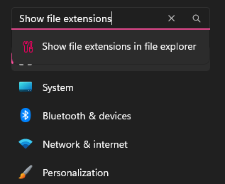
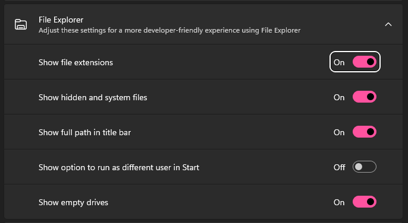
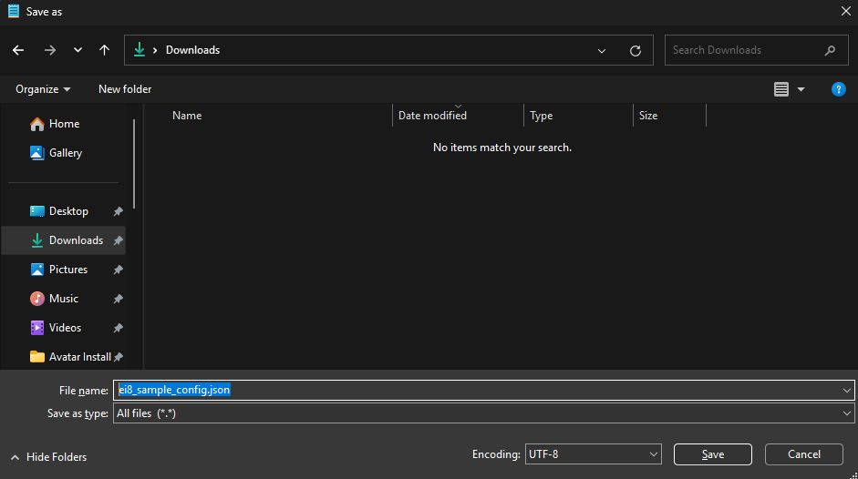
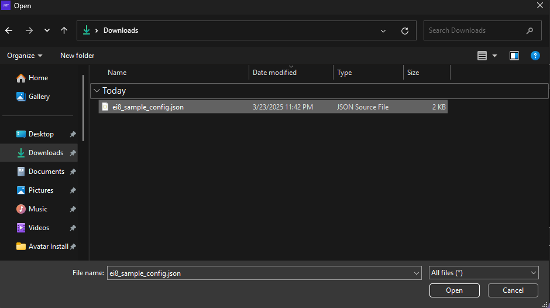

# Quick Start

The **Quick Start Guide** will help you set up **ei8 Avatar** quickly with step-by-step instructions.  
Follow the installation steps carefully to ensure everything runs smoothly on your system.

<br>

### 📚 Prerequisites

Before installing **ei8 Avatar**, ensure you have the following:

- **Operating System**: Windows 10 or higher (64-bit).
- **Virtualization**: Enabled in BIOS (required for Docker).
- [**Docker Desktop**](https://www.docker.com): Latest version installed and running.
- **CPU**: At least **quad-core** (Intel i5 / Ryzen 5 or better recommended).
- **RAM**: Minimum **8GB** (16GB recommended for better performance).
- **Storage**: At least **20GB of free disk space** (SSD recommended).
- **Internet**: Stable connection for downloading dependencies.
- **Admin Privileges**: Required for installation and running certain commands.

<br>

### 🚀 Installation Steps

This section provides a step-by-step guide to installing **ei8 Avatar** and setting it up for the first time.

#### 1️⃣ Enable File Extensions on Windows

Before proceeding, enable file extensions to ensure correct file handling:

1. Open the `Settings` app on Windows.
2. Search for `Show file extensions` in the file explorer and click on the first entry on the dropdown.



3. Turn on the `Show file extensions` setting as shown.



<br>

#### 2️⃣ Create Configuration File

1. Open `Notepad`
2. Copy and paste the following JSON content:

```json
{
  "avatars": [
    {
      "name": "sample",
      "owner_name": "owner sample",

      "cortex_graph": {
        "db_name": "graph-sample",
        "db_username": "root",
        "db_url": "http://host.docker.internal:8529",
        "arango_root_password": ""
      },

      "avatar_api": {
        "token_issuer_url": "https://login.fibona.cc",
        "api_name": "avatarapi-sample"
      },

      "cortex_library": {
        "neurons_url": "http://fibona.cc/sample/cortex/neurons",
        "terminals_url": "http://fibona.cc/sample/cortex/terminals"
      },

      "d23": {
        "oidc_authority_url": "https://login.fibona.cc",
        "client_id": "d23-sample",
        "base_path": "/sample/d23"
      },

      "network": {
        "local_ip": "192.168.50.2",
        "avatar_in_port": 64101,
        "d23_blazor_port": 64103,
        "neurul_server": "fibona.cc"
      }
    }
  ],
  "destination": "%USERPROFILE%\\Documents\\ei8\\Avatar",
  "template_url": "https://github.com/ei8/avatar-template.git",
  "network": {
    "local_ip": "192.168.50.2",
    "ssh": {
      "server_alive_interval": 60,
      "server_alive_count_max": 525600,
      "port": 2222,
      "host_name": "ei8.host",
      "remote_forward": "sample:80 192.168.50.2:9393",
      "local_port": 9393
    }
  }
}
```
> [!NOTE]
> More sample config files available [here](https://github.com/ei8/avatar-installer/tree/9a9aed8d23eb9fd5c63d919924af05945ad91b0a/src/test/Domain.Model/Configuration).

3. Save the file as `ei8_sample_config.json` in your `Downloads` folder
   - Make sure to select `All Files` in the `Save as type` dropdown
   - Ensure the filename ends with `.json` and not `.txt`



<br>

#### 3️⃣ Download the Avatar Installer

1. Download and open the Avatar Installer app.
2. On the home page, click on `New` and choose a configuration file.
3. Inside the `New` page, click on `Choose File`. Choose the downloaded `ei8_sample_config.json` and click open.



4. After choosing a configuration file, click `Create` and wait for it to finish.
5. Once completed, you can now run your very own **Avatar Server**. Your saved files are in `Documents/ei8/Avatar`.
6. If you intend to use Un8y:
    1. Download the [applicable plugins version](https://drive.google.com/drive/folders/1OdmTfYoyUtVXbF9-22Q7SOHS8R8k4FNy?usp=sharing).
    2. Extract its contents to [avatar]\un8y\plugins\

> [!NOTE]
> If Avatar is being setup for local testing, set [avatar]\un8y\variables.env > BASE_PATH to an empty string.

<br>

### ✅ Next Steps

Now that you have installed **ei8 Avatar**, you can start configuring and using it.  
Check out the [**User Manual**](configuration.md) for more advanced settings and customization options.
